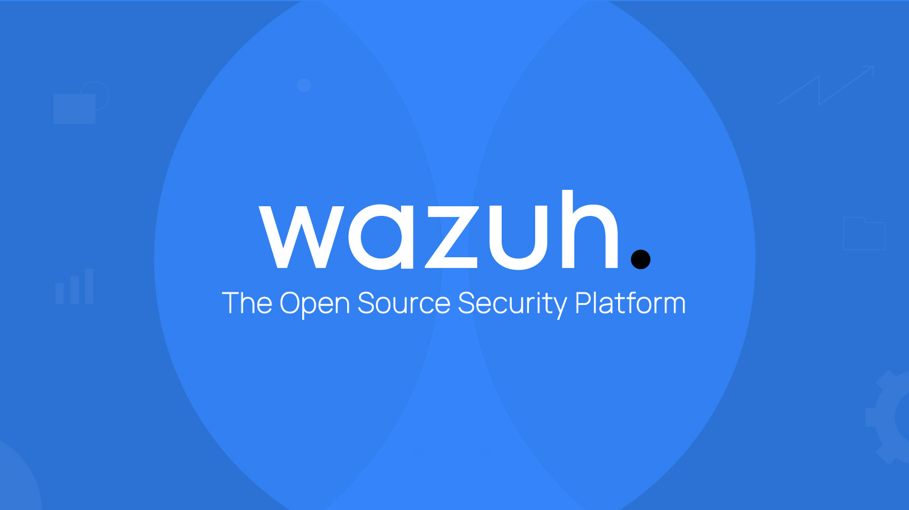
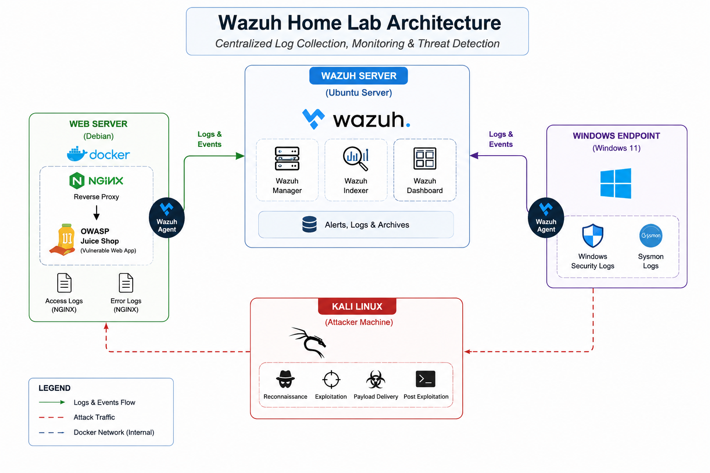

# Wazuh Home Lab

A practical cybersecurity home lab built with **Wazuh** to simulate real-world Security Operations Center (SOC) activities, including centralized log collection, threat detection, alert triage, incident response, and detection engineering.

The purpose of this project is to provide a hands-on environment for learning how attacks are generated, detected, investigated, and responded to using an open-source SIEM platform.

---

## Table of Contents

- [Architecture](#architecture)
- [Lab Components](#lab-components)
- [Documentation](#documentation)
- [Roadmap](#roadmap)
- [Learning Objectives](#learning-objectives)
- [Future Enhancements](#future-enhancements)
- [References](#references)

---

## Architecture

The lab consists of four machines that simulate a small enterprise environment.

---

## Lab Components

| Component | Operating System | Purpose |
|-----------|------------------|---------|
| **Wazuh Server** | Ubuntu Server | Hosts the Wazuh Manager, Indexer, and Dashboard. |
| **Web Server** | Debian | Hosts NGINX and OWASP Juice Shop using Docker. |
| **Windows Endpoint** | Windows 11 | Generates Windows Security and Sysmon logs. |
| **Kali Linux** | Kali Linux | Simulates attacker activities against the lab environment. |

---

## Documentation

Follow the guides below in the recommended order.

| Step | Guide | Description |
|------|-------|-------------|
| 1 | [Wazuh Server](Wazuh-Server/) | Deploy the Wazuh Server, Indexer, and Dashboard. |
| 2 | [Web Server](Web-Server/) | Deploy the Debian web server, configure Docker, NGINX, OWASP Juice Shop, and install the Wazuh Agent. |

> Additional guides for Windows Endpoint, Kali Linux, custom detection rules, and attack simulations will be added as the project evolves.

---

## Roadmap

The following milestones are planned for this home lab.

- [x] Deploy Wazuh Server
- [x] Deploy Debian Web Server
- [x] Configure Docker Environment
- [x] Deploy NGINX Reverse Proxy
- [x] Deploy OWASP Juice Shop
- [x] Install and Configure Wazuh Agent
- [ ] Deploy Windows Endpoint
- [ ] Configure Sysmon
- [ ] Deploy Kali Linux
- [ ] Configure Suricata
- [ ] Create Custom Wazuh Rules
- [ ] Simulate Web Attacks
- [ ] Simulate Windows Attacks
- [ ] Threat Hunting Scenarios
- [ ] MITRE ATT&CK Mapping
- [ ] Active Response
- [ ] Detection Engineering

---

## Learning Objectives

By completing this lab, you will gain practical experience with:

- Wazuh deployment and administration
- Docker and containerized applications
- Linux endpoint monitoring
- Windows Security and Sysmon log analysis
- Centralized log collection
- Threat detection
- Alert triage
- Incident response
- Detection engineering
- Web attack detection
- Threat hunting
- Custom Wazuh rules

---

## Future Enhancements

The lab will continue to expand with additional components and attack scenarios, including:

- Active Directory
- Sigma Rule Integration
- Malware Detection
- File Integrity Monitoring (FIM)
- Vulnerability Detection
- Custom Decoders
- Active Response
- Email Alerting
- Dashboard Customization
- Additional vulnerable applications
- Enterprise attack simulations

---

## References

- Wazuh Documentation: https://documentation.wazuh.com/current/index.html
- Wazuh Quick Start Guide: https://documentation.wazuh.com/current/quickstart.html

---

## Contributing

This repository is a personal learning project and will continue to evolve with new attack scenarios, detection rules, and documentation.

If you have suggestions, improvements, or ideas for additional scenarios, feel free to open an issue or submit a pull request.

⭐ If you find this repository useful, consider giving it a star.
