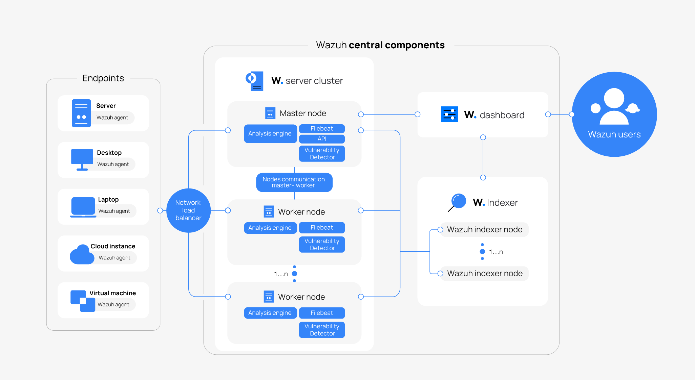

# Wazuh Server

This directory covers the deployment and initial configuration of the Wazuh Server used in this home lab.

The objective is to build a centralized Security Information and Event Management (SIEM) platform capable of collecting logs, monitoring endpoints, detecting threats, and supporting incident response activities.

For simplicity, all Wazuh components are deployed on a single Ubuntu Server.

---

## Wazuh Architecture

A standard Wazuh deployment consists of three core components:

- **Wazuh Server** – Receives and analyzes security events from Wazuh agents.
- **Wazuh Indexer** – Stores and indexes security events for fast searching and analytics.
- **Wazuh Dashboard** – Provides a web interface for monitoring, visualization, and management.



> **Note**
>
> To reduce hardware requirements, this lab deploys all three components on a single Ubuntu Server.

---

## Lab Environment

| Component | Value |
|-----------|-------|
| Operating System | Ubuntu Server |
| Wazuh Version | 4.14 |
| Deployment Type | Single Node |
| Components Installed | Wazuh Server, Wazuh Indexer, Wazuh Dashboard |

---

## Prerequisites

Before installation, ensure the following requirements are met:

- Ubuntu Server installed
- Root or sudo privileges
- Internet connectivity
- Minimum 4 GB RAM (8 GB recommended)
- Static IP address (recommended)

---

## Installation

Download and execute the official Wazuh installation script.

```bash
curl -sO https://packages.wazuh.com/4.14/wazuh-install.sh
sudo bash ./wazuh-install.sh -a
```

The `-a` option installs:

- Wazuh Server
- Wazuh Indexer
- Wazuh Dashboard

on the same machine.

> **Note**
>
> If the installation script is unavailable, verify that the version number matches the latest Wazuh release. Refer to the official documentation for the latest installation instructions.

---

## Initial Login

After installation completes successfully, the installer displays the Dashboard URL and administrator credentials.

Example:

```text
INFO: --- Summary ---
INFO: You can access the web interface https://<WAZUH_DASHBOARD_IP_ADDRESS>
    User: admin
    Password: <ADMIN_PASSWORD>
INFO: Installation finished.
```

Login to the Wazuh Dashboard using the provided credentials.

---

## Verify Installation

Verify that all Wazuh services are running.

```bash
sudo systemctl status wazuh-manager
sudo systemctl status wazuh-indexer
sudo systemctl status wazuh-dashboard
```

Or verify all Wazuh services at once:

```bash
sudo systemctl status wazuh-*
```

---

## Wazuh Use Cases

| Endpoint Security | Threat Intelligence | Security Operations | Cloud Security |
|-------------------|---------------------|---------------------|----------------|
| Configuration Assessment | Threat Hunting | Incident Response | Container Security |
| Malware Detection | Log Data Analysis | Regulatory Compliance | Posture Management |
| File Integrity Monitoring | Vulnerability Detection | IT Hygiene | Workload Protection |

---

## Next Step

Continue to the **Web Server** setup guide to:

- Deploy the web server
- Install the Wazuh Agent
- Register the endpoint with the Wazuh Server
- Start collecting security logs

---

## References

- Official Wazuh Quick Start Guide: https://documentation.wazuh.com/current/quickstart.html
- Official Wazuh Documentation: https://documentation.wazuh.com/current/index.html
