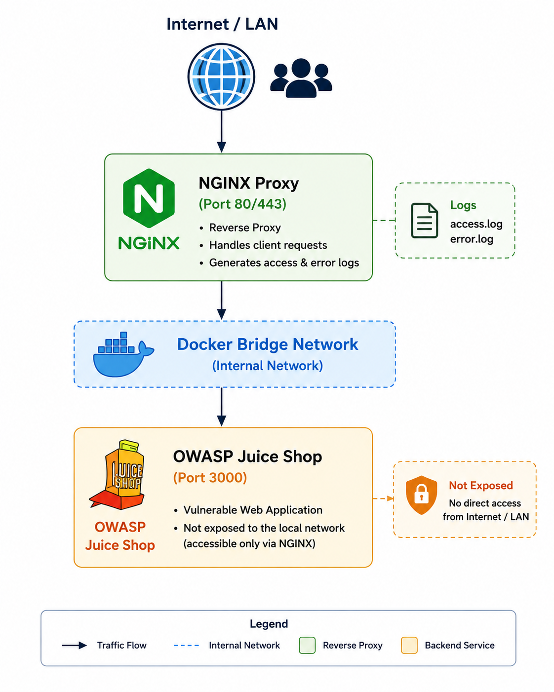

# Web Server

This directory covers the deployment of a vulnerable web application used as a target system for the Wazuh Home Lab.

The web server is built using Docker and consists of:

- **NGINX** – Acts as a reverse proxy and generates web server access and error logs.
- **OWASP Juice Shop** – An intentionally vulnerable web application used for security testing and attack simulation.

The generated logs are collected by the Wazuh Agent and forwarded to the Wazuh Server for monitoring, threat detection, and analysis.

---

## Table of Contents

- [Architecture](#architecture)
- [Documentation](#documentation)
- [Roadmap](#roadmap)
- [What You'll Learn](#what-youll-learn)
- [Lab Components](#lab-components)
- [References](#references)

---

## Architecture

> **Note**
>
> OWASP Juice Shop is **not exposed directly** to the local network. All client requests are routed through the NGINX reverse proxy.

---

## Documentation

Follow the guides below in the recommended order.

| Step | Guide | Description |
|------|-------|-------------|
| 1 | [Docker Installation](Docker-Installation.md) | Install Docker Engine and Docker Compose on Debian. |
| 2 | [Web Server Setup](Web-Server-Setup.md) | Deploy the NGINX reverse proxy and OWASP Juice Shop using Docker Compose. |
| 3 | [Wazuh Agent Installation](Wazuh-Agent-Installation.md) | Install, register, and configure the Wazuh Agent to monitor Linux, NGINX access, and NGINX error logs. |

---

## Roadmap

The deployment process follows the workflow below:

1. Install Docker Engine and Docker Compose.
2. Deploy the NGINX reverse proxy and OWASP Juice Shop.
3. Verify that the containers are running successfully.
4. Verify that the web application is accessible through the NGINX reverse proxy.
5. Verify that NGINX access and error logs are generated.
6. Install and register the Wazuh Agent.
7. Configure the Wazuh Agent to monitor NGINX access and error logs.
8. Configure Wazuh rules or pipelines to process web server logs.
9. Generate web traffic and prepare the environment for threat detection.

---

## What You'll Learn

After completing this section, you will be able to:

- Install Docker Engine and Docker Compose on Debian.
- Deploy multiple containers using Docker Compose.
- Configure NGINX as a reverse proxy.
- Isolate backend services from the local network.
- Configure persistent storage for NGINX access and error logs.
- Deploy OWASP Juice Shop as a vulnerable web application.
- Install and configure the Wazuh Agent.
- Configure the Wazuh Agent to monitor web server logs.
- Understand how web server logs are ingested into Wazuh.
- Prepare the web server for centralized log collection and threat detection.

---

## Lab Components

| Component | Purpose |
|-----------|---------|
| Debian 13 | Operating System |
| Docker Engine | Container Runtime |
| Docker Compose | Multi-container Orchestration |
| NGINX | Reverse Proxy |
| OWASP Juice Shop | Vulnerable Web Application |
| Wazuh Agent | Endpoint Monitoring & Log Collection |

---

## References

- Docker Engine Installation (Debian): https://docs.docker.com/engine/install/debian/
- Docker Compose Documentation: https://docs.docker.com/compose/
- OWASP Juice Shop Docker Image: https://hub.docker.com/r/bkimminich/juice-shop
- NGINX Official Docker Image: https://hub.docker.com/_/nginx
- Wazuh Agent Documentation: https://documentation.wazuh.com/current/user-manual/agents/index.html
