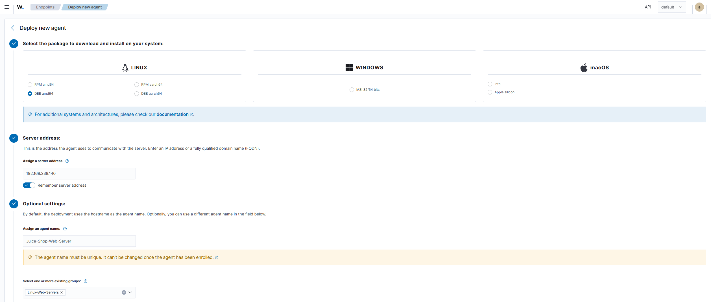
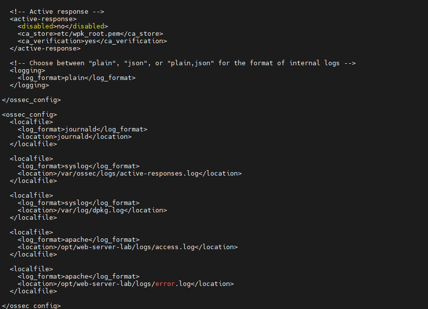

# Wazuh Agent

This guide explains how to install and configure the Wazuh Agent on the Debian web server. The agent is responsible for collecting system and application logs and securely forwarding them to the Wazuh Server for analysis.

---

## Objectives

After completing this guide, you will be able to:

- Deploy a Wazuh Agent from the Wazuh Dashboard.
- Register the web server with the Wazuh Server.
- Configure the agent to monitor NGINX access and error logs.
- Verify that logs are successfully received by Wazuh.

---

# Install Wazuh Agent

## Step 1 - Generate the Installation Command

1. Open the **Wazuh Dashboard**.
2. Navigate to **Agent Management**.
3. Select **Deploy New Agent**.
4. Configure the agent as shown below.



Example configuration:

| Setting | Value |
|----------|-------|
| Operating System | Debian / Ubuntu |
| Wazuh Manager Address | `192.168.238.140` |
| Agent Group | `Linux-Web-Servers` |
| Agent Name | `Juice-Shop-Web-Server` |

The dashboard generates an installation command similar to the following:

```bash
wget https://packages.wazuh.com/4.x/apt/pool/main/w/wazuh-agent/wazuh-agent_4.14.5-1_amd64.deb

sudo WAZUH_MANAGER='192.168.238.140' \
WAZUH_AGENT_GROUP='Linux-Web-Servers' \
WAZUH_AGENT_NAME='Juice-Shop-Web-Server' \
dpkg -i ./wazuh-agent_4.14.5-1_amd64.deb
```

---

## Step 2 - Install the Agent

Run the generated command on the Debian web server.

---

## Step 3 - Start the Agent

Reload systemd and start the Wazuh Agent.

```bash
sudo systemctl daemon-reload

sudo systemctl enable wazuh-agent

sudo systemctl start wazuh-agent
```

Verify that the service is running.

```bash
sudo systemctl status wazuh-agent
```

---

# Configure NGINX Log Collection

By default, the Wazuh Agent monitors operating system logs only.

To collect NGINX access and error logs, update the agent configuration.

Edit:

```text
/var/ossec/etc/ossec.conf
```

Add the following configuration before the closing `</ossec>` tag.

```xml
<localfile>
  <log_format>apache</log_format>
  <location>/opt/web-server-lab/logs/access.log</location>
</localfile>

<localfile>
  <log_format>apache</log_format>
  <location>/opt/web-server-lab/logs/error.log</location>
</localfile>
```

Example:



---

## Restart the Agent

After updating the configuration, restart the Wazuh Agent.

```bash
sudo systemctl restart wazuh-agent
```

---

## Verify Log Collection

Generate some web traffic by opening the Juice Shop application in a browser.

Then verify that the events are received in the Wazuh Dashboard.

Navigate to:

```
Dashboard
    → Discover
```

or

```
Dashboard
    → Security Events
```

Search for the agent name:

```
Juice-Shop-Web-Server
```

You should begin seeing NGINX access and error log events.

---

## Next Step

The web server is now sending:

- Linux system logs
- NGINX access logs
- NGINX error logs

to the Wazuh Server.

The next phase of the lab is to create detection rules, dashboards, and alerts for web attacks against OWASP Juice Shop.
